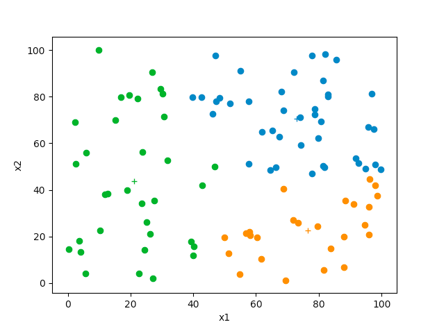
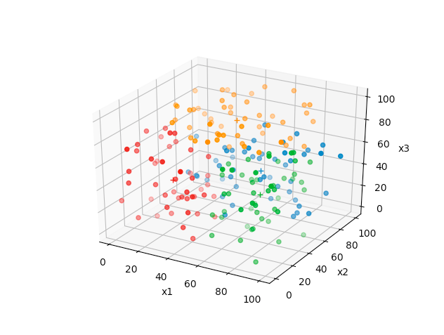

# k-means
K-means unsupervised algorithm for sorting samples into k clusters.

Will accept input data of arbitrarily large dimensions. Because I like pretty graphs and such, I've made it update plots as the centroids converge for data of two or three dimensions:

 
