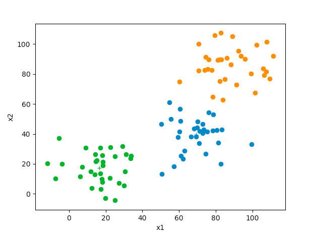
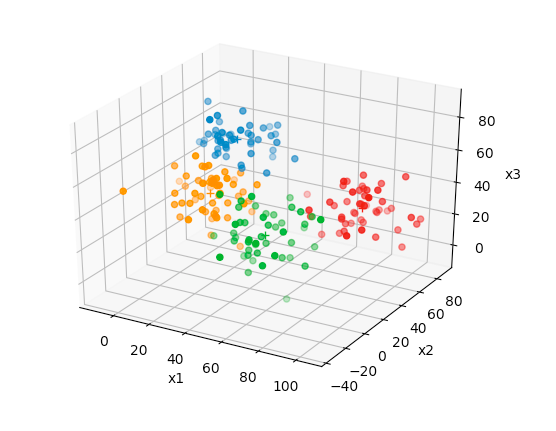

# k-means
K-means unsupervised algorithm for sorting samples into k clusters.

Will accept input data of arbitrarily large dimensions. Because I like pretty graphs and such, I've made it update plots as the centroids converge for data of two or three dimensions. Here, on uniformly distributed samples:

  
  

...and here, on samples generated by choosing k uniformly distributed positions and generating guassian distributed samples centered on these positions in order to 'clump' samples together:

  
  

